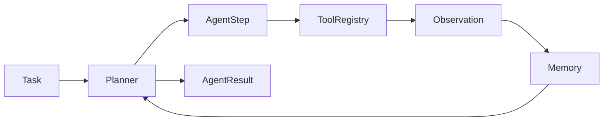

# agent-framework

Tiny, inspectable agent runtime with tools, memory, planning steps, and a trace
you can read.

**Thesis:** agents are easier to trust when the loop is visible. `agent-framework`
shows the core runtime contract - plan, act, observe, remember, finish - without
hiding it inside a large framework.

## Run It In 30 Seconds

```bash
python -m pip install -e ".[dev]" && python examples/no_api_key_agent.py
```

No API key is required. The demo uses a deterministic planner and a safe
arithmetic tool implemented with `ast`, not `eval()`.

## Why Care?

- You want to understand tool-calling agents from first principles.
- You want a small runtime you can replace piece by piece.
- You need examples that are safe enough to copy into your own experiments.

## What Makes It Different?

| This repo | Heavy agent frameworks |
|---|---|
| Explicit `AgentStep` trace | Often hidden behind callbacks |
| Bring-your-own planner | Planner/model coupling is common |
| Tiny tool registry | Large plugin ecosystems |
| Local no-key demo | Cloud setup usually required |

## API Shape

```python
from agent_framework.agent import Agent, AgentStep
from agent_framework.tools import ToolRegistry

def planner(context: dict) -> AgentStep:
    return AgentStep(thought="done", action="finish")

tools = ToolRegistry()
agent = Agent(name="demo", tools=tools, planner=planner)
result = agent.run("inspect the loop")
print(result.steps)
```

## Architecture



## Correctness And Safety

- Tool names are explicit; unknown tools fail loudly.
- Tool execution errors are captured in the step trace.
- The README and demo avoid unsafe `eval()` patterns.
- `max_steps` bounds runaway planners.

## Limitations

- This is not a sandbox. A dangerous tool is still dangerous.
- The default planner is only for tests and demos.
- Real LLM calls should return structured `AgentStep` data and validate
  tool arguments before execution.

## Development

```bash
python -m pip install -e ".[dev]"
pytest
python scripts/benchmark.py
```

See [ARCHITECTURE.md](docs/ARCHITECTURE.md), [ROADMAP.md](ROADMAP.md), and
[RELEASE.md](RELEASE.md).
