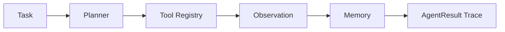

# Architecture

`agent-framework` thesis: tiny inspectable agent runtime with tools, memory, planning steps, and traceable execution.

## Design Rules

- Keep the public API small enough to inspect in one sitting.
- Make demos run locally without network credentials.
- Put correctness checks in tests, conformance scripts, or benchmark scripts
  instead of relying on README claims.
- Prefer explicit failure modes over surprising implicit behavior.
